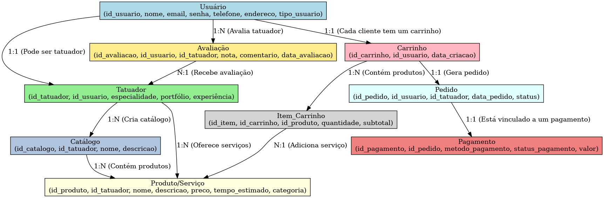

# 🎨 EstudioTatto

Projeto Integrador apresentado ao Centro Universitário SENAC como parte dos requisitos para finalização do Projeto Integrador: Desenvolvimento de Sistemas orientado a objetos

Orientador: Prof. Enoque Leal

## 📌 Sobre o Projeto

Este projeto tem como objetivo conectar tatuadores e clientes, permitindo que os usuários localizem profissionais, visualizem portfólios e realizem agendamentos de forma simples e intuitiva.

---

## Paleta de Cores
https://paletadecores.com/paleta/aeaeae/969696/7d7d7d/656565/4c4c4c/
https://paletadecores.com/paleta/939393/aeaeae/c9c9c9/e4e4e4/ffffff
---

## ✅ Requisitos Funcionais

### 🔐 **Autenticação e Cadastro**

- [ ] O sistema deve permitir a criação de perfis para os clientes e tatuadores incluindo informações pessoais, contatos e portfólio de trabalhos;
- [ ] O sistema deve permitir login de usuários e tatuadores;
- [ ] O sistema deve armazenar as informações dos clientes e tatuadores;
- [ ] Deve haver um formulário de cadastro para novos usuários;
- [ ] Tatuadores devem ter um cadastro específico com informações detalhadas;

### 🏠 **Navegação e Catálogo**

- [ ] A página inicial deve exibir destaques de tatuadores e estilos populares;
- [ ] O catálogo deve listar tatuadores filtráveis por especialidade, localização e avaliações;
- [ ] Cada tatuador terá uma página de perfil com seu portfólio, descrição e contato;
- [ ] O sistema deve permitir que os clientes avaliem os tatuadores, deixando comentários e feedbacks sobre suas experiências;

### 🛒 **Carrinho e Pagamento**
- [ ] Os clientes devem poder adicionar serviços ao carrinho;
- [ ] O pagamento deve ser realizado de forma segura através de métodos como Pix, cartão de crédito e boleto;

### 👤 **Perfil do Tatuador**
- [ ] O tatuador poderá adicionar e gerenciar seus serviços e fotos de portfólio;
- [ ] O perfil permitirá edição de dados como localização e redes sociais;
- [ ] O sistema deve permitir aos tatuadores responder e avaliar clientes, deixando comentários e feedbacks sobre suas experiências;

### ℹ️ **Outras Funcionalidades**

- [ ] Página "Sobre Nós" com informações sobre a plataforma;
- [ ] Sistema de avaliação para clientes darem feedback sobre os serviços;
- [ ] Suporte via chat ou e-mail;

---

## 🚀 Requisitos Não Funcionais

- 🔹 **Experiência do Usuário (UX):** Interface responsiva e intuitiva;
- 🔹 **O sistema deve estar em conformidade com a Lei nº 13.709/2018 (Lei Geral de Proteção de Dados - LGPD) e com o Marco Civil da Internet;
- 🔹 **O sistema deve ser responsivo, garantindo compatibilidade com diferentes navegadores e dispositivos, incluindo desktops, tablets e smartphones;
- 🔹 **Segurança:** Proteção de dados via criptografia e autenticação segura;
- 🔹 **Desempenho:** Tempo de carregamento otimizado para experiência fluida;
- 🔹 **Escalabilidade:** Estrutura que suporte o crescimento da base de usuários;

---

## 👤 Requisitos de usuário

-🔹	**Explorar diferentes tatuadores, visualizar portfólios e entrar em contato com os profissionais de forma simples;
-🔹 **Agendar sessões de tatuagem escolhendo o estilo desejado, horário disponível e tatuador de preferência;

## 🖥️ Protótipo de telas do projeto

Landingpage:

---
## MER | Modelo Entidade e Relacionamento do Projeto

## 📂 Tecnologias Utilizadas

- **Front-end:** HTML, CSS, JavaScript
- **Back-end:**
- **Banco de Dados:**

💡 *Projeto em desenvolvimento por nossa equipe!* 🚀
